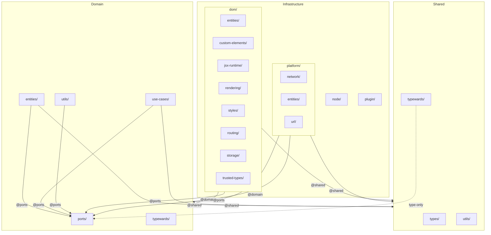

# Architecture — Hexagonal

```
src/
├── domain/                              # Core — zero infrastructure dependencies
│   ├── entities/
│   │   ├── garbage-collection/          # GarbageCollectableObject, GarbageCollectedEvent (WeakRef)
│   │   ├── IdGenerator.ts               # ID Generator
│   │   ├── MappedIdGenerator.ts         # Mapped ID Generator
│   │   ├── ObservableFromEventListener.ts
│   │   └── reactive/
│   │       ├── core/                    # Callable, CallableObservable, Observable,
│   │       │                            # ObservableWithValue, ReactiveArray, ReactiveValue
│   │       └── proxied/                 # ProxiedValue, ProxiedArray
│   │
│   ├── ports/                           # Interfaces/contracts (importable by any layer)
│   │   ├── ElementFactoryPort.ts        # Element creation factory interface
│   │   ├── HistoryManagerPort.ts
│   │   ├── VirtualFragmentPort.ts
│   │   ├── hooks/                       # UseObservePort, UseComputedObservePort, UsePromisePort, etc.
│   │   └── reactive/
│   │       ├── core/                    # ObservablePort, ReactiveValuePort, ReactiveArrayPort,
│   │       │                            # Subscription, TargetPort, ReactiveArrayTargetPort,
│   │       │                            # ObservableOrConst, etc.
│   │       └── proxied/                 # ProxiedValuePort, ProxyHandlerPort, ObservableProxyPort,
│   │                                    # ParentSubscription, UnproxifyPort, etc.
│   │
│   ├── use-cases/
│   │   ├── hooks/                       # useObserve, useComputedObserve, useAsyncComputedObserve,
│   │   │   │                            # useWatch, usePromise, usePureFunction, useStringTemplate
│   │   │   └── tests/                   # Unit tests for hooks
│   │   ├── i18n/                        # I18n class — pure translation logic
│   │   └── proxyHandlers/               # ArrayProxyHandler, CommonObjectProxyHandler,
│   │                                    # DateProxyHandler, MapProxyHandler, SetProxyHandler,
│   │                                    # PrimitiveProxyHandler, FunctionProxyHandler, etc.
│   │
│   ├── utils/                           # getObservables, bindObservable
│   └── typewards/                       # isObservable
│
├── shared/                              # Utilities, types and typewards — no domain or infra dependencies
│   ├── types/                           # AnyObject, PrimitiveType, KebabCase, SearchParams,
│   │                                    # DeepReadonly, PickWritable, IsAny, Typeof, etc.
│   ├── typewards/                       # hasToJSON, isProxiedValue
│   └── utils/                           # unproxify, formatToKebabCase, getFormData, wait,
│       │                                # throttle, debounce, pick, omit, isNil, extendsObject,
│       │                                # getBrowser, getPlatform, getCSSStyleSheetText, etc.
│       └── clone/                       # cloneArray, cloneCommonObject, cloneDate, cloneMap, cloneSet
│
├── infrastructure/
│   ├── dom/                             # Adapter — Browser DOM
│   │   ├── index.ts                     # Barrel — exports entire DOM module
│   │   ├── entities/                    # ElementArrayTarget (lightweight, ReactiveArrayTargetPort),
│   │   │                                # ElementProxiedArrayTarget (full TargetPort)
│   │   ├── custom-elements/             # createCustomElement, customElement, createElementProperties
│   │   │   ├── components/              # ElementInternals, Host, Slot
│   │   │   ├── properties/              # defineEvent, defineMethod, definePropertyFromObservable,
│   │   │   │                            # defineReflectedAttributes
│   │   │   └── typewards/               # isMichiCustomElement
│   │   ├── jsx-runtime/                 # Fragment, jsx, jsxs, jsxDEV
│   │   │   └── generated/               # JSX namespace (global augmentation)
│   │   │       └── htmlType/            # CSSProperties, DataGlobalAttributes, Events,
│   │   │           ├── Events/          # AllEvents, GlobalEvents, TypedEvent, TypedMouseEvent, etc.
│   │   │           └── generated/       # HTMLElements, SVGElements, MathMLElements, ValueSets
│   │   ├── rendering/                   # create, render, ElementFactory, VirtualFragment
│   │   │   ├── components/              # AsyncComponent, Fragment, GenericElement, If, List
│   │   │   └── typewards/               # isElement, isDOMElement, isHTMLElement, etc.
│   │   ├── routing/                     # createRouter
│   │   │   ├── components/              # Redirect, Router, Title
│   │   │   ├── hooks/                   # useHash, useSearchParams, useTitle
│   │   │   └── entities/HistoryManager/ # HistoryManager, ModernHistoryManager, LegacyHistoryManager
│   │   ├── styles/                      # css
│   │   │   ├── hooks/                   # useStyleSheet, useCssVariables, useAnimation, useTransition
│   │   │   └── typewards/               # isCSSObject, isCSSVariable
│   │   ├── storage/                     # Storage types
│   │   │   ├── entities/                # CookieStorage
│   │   │   ├── hooks/                   # useStorage, useIndexedDB
│   │   │   └── typewards/               # storageIsCookieStorage
│   │   ├── trusted-types/               # trustedTypePolicy, makeMichijsTheDefaultTrustedPolicy
│   │   └── polyfills/                   # createBuiltInElement (Safari built-in elements)
│   │
│   ├── platform/                        # Adapter — DOM-agnostic JS APIs
│   │   ├── index.ts                     # Barrel — exports entire platform module
│   │   ├── constants/                   # Namespaces (SVG, MathML, etc.)
│   │   ├── entities/                    # EventDispatcher
│   │   ├── network/                     # doFetch, doBlobFetch, doGenericFetch
│   │   │   └── hooks/                   # useFetch
│   │   ├── types/                       # GetJSXProps, WithChildren
│   │   └── url/                         # URL utilities
│   │       ├── types.ts                 # UrlFunction type
│   │       └── utils/                   # urlFn, createURL, normalizeURL, setSearchParam
│   │
│   ├── node/                            # Adapter — Node.js
│   │   └── jsx-runtime/                 # SSR: Node JSX runtime
│   │
│   └── plugin/                          # Adapter — esbuild build plugin
│       ├── index.ts                     # Barrel — exports michiJSXPlugin
│       ├── michiJSXPlugin.ts            # esbuild Plugin (onLoad hook)
│       └── transform/                   # JSX-to-DOM transform engine
│           ├── jsxVisitor.ts            # Core visitor
│           ├── helperImports.ts         # Import generation
│           └── astUtils.ts              # AST utilities
│
├── index.ts                             # Main entry point (browser)
└── index.node.ts                        # Node.js entry point
```

## Target architecture

```
ReactiveArrayTargetPort            TargetPort (extends ReactiveArrayTargetPort)
     ▲                                  ▲
     │                                  │
ElementArrayTarget               ElementProxiedArrayTarget
(lightweight — benchmarks,        (full — ProxiedArray rendering,
 non-proxied ReactiveArray)        supports pop, shift, splice, etc.)
```

`ElementArrayTarget` implements only `ReactiveArrayTargetPort` — the minimal set of methods
needed for benchmarks and non-proxied arrays: `create`, `$clear`, `$replace`, `push`, `$remove`, `$swap`.

`ElementProxiedArrayTarget` extends `ElementArrayTarget` and implements `TargetPort` — adding
`pop`, `shift`, `reverse`, `splice`, `fill`, `prependItems`, `insertItemsAt`, `insertChildNodesAt`.
The `List` component uses `ElementProxiedArrayTarget` when the data is a `ProxiedArray`,
and `ElementArrayTarget` for plain `ReactiveArray` data.

## Dependency rules between layers

```
shared ──────► (no domain or infrastructure dependencies)
               Can only import from @ports for types (type-only imports)

domain ──────► @shared, @ports
               NEVER imports from infrastructure

infrastructure ► @domain, @ports, @shared
                 Cross-layer imports use aliases, not relative paths
```

### Details

| Layer | Can import from | CANNOT import from |
|-------|----------------|-------------------|
| `shared/` | `@ports` (only `import type`) | `@domain` (values), `@infrastructure` |
| `domain/entities/` | `@shared`, `@ports` | `@infrastructure` |
| `domain/ports/` | `@domain`, `@shared` | `@infrastructure` |
| `domain/use-cases/` | `@shared`, `@ports`, relative entities | `@infrastructure` |
| `infrastructure/` | `@domain`, `@ports`, `@shared` | relative paths crossing layers |

## Barrel files (index.ts)

Each main module exposes a barrel that re-exports all its public content:

| Barrel | What it exports |
|--------|----------------|
| `src/domain/index.ts` | All domain entities, use-cases, utils and typewards + re-export of ports |
| `src/domain/ports/index.ts` | All interfaces/contracts |
| `src/shared/index.ts` | All shared utils, types and typewards |
| `src/infrastructure/dom/index.ts` | Entire DOM module: entities, custom-elements, jsx-runtime, rendering, styles, routing, storage, trusted-types, polyfills |
| `src/infrastructure/platform/index.ts` | Entire platform module: constants, entities, network, types, url |
| `src/infrastructure/plugin/index.ts` | esbuild plugin: `michiJSXPlugin` |

## TSConfig path aliases

| Alias | Resolves to |
|-------|-------------|
| `@ports` | `./src/domain/ports/index` |
| `@domain` | `./src/domain/index` |
| `@domain/*` | `./src/domain/*` |
| `@shared` | `./src/shared/index` |
| `@shared/*` | `./src/shared/*` |
| `@michijs/michijs/jsx-runtime` | `./src/infrastructure/dom/jsx-runtime/index` |
| `@michijs/michijs/jsx-dev-runtime` | `./src/infrastructure/dom/jsx-runtime/index` |
| `@michijs/michijs/*` | `./src/*` |
| `@michijs/michijs` | `./src/index` |

Base URL: `.` (project root)

## Dependency diagram


