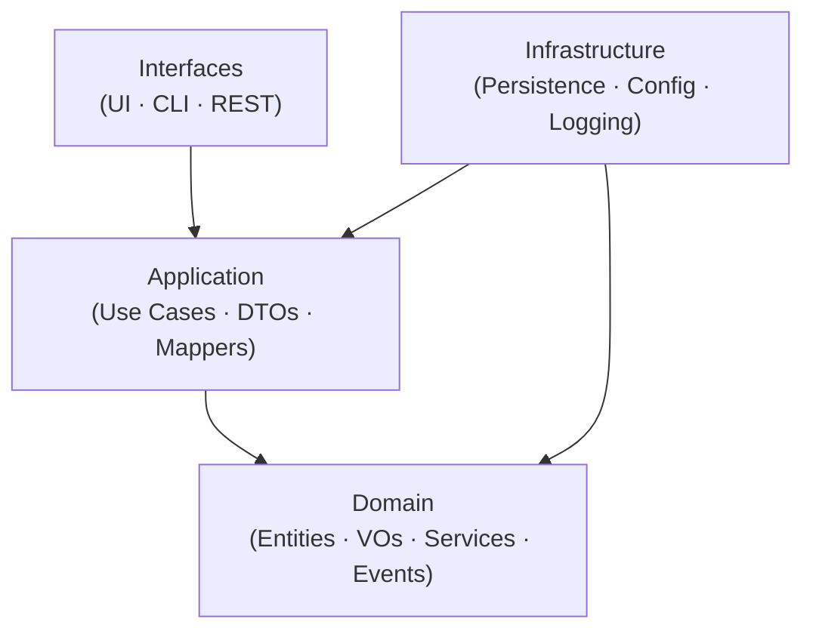

# Project structure

- `src/`
  - `domain/` — Core business logic (pure, no external deps)
    - `entities/`
      - `Todo.ts`
    - `value-objects/`
      - `TodoId.ts`
    - `repositories/`
      - `TodoRepository.ts`
    - `services/`
      - `TodoValidator.ts`
    - `events/`
      - `TodoCreatedEvent.ts`
  - `application/` — Use cases: orchestrating the domain
    - `use-cases/`
      - `GetTodos.ts`
      - `AddTodo.ts`
      - `ToggleTodo.ts`
      - `DeleteTodo.ts`
    - `dto/`
      - `TodoDTO.ts`
    - `mappers/`
      - `TodoMapper.ts`
    - `services/`
      - `TodoOrchestrationService.ts`
  - `infrastructure/` — Secondary adapters (implementations)
    - `persistence/`
      - `TodoRepositoryLocalStorage.ts`
      - `TodoRepositoryAPI.ts`
    - `config/`
      - `container.ts`
    - `logging/`
      - `ConsoleLogger.ts`
  - `interfaces/` — Primary adapters (entry points)
    - `react/`
      - `components/`
        - `TodoItem.tsx`
        - `TodoList.tsx`
      - `hooks/`
        - `useTodos.ts`
      - `pages/`
        - `HomePage.tsx`
      - `providers/`
        - `TodoProvider.tsx`
    - `cli/`
      - `index.ts`
    - `rest/`
      - `controllers/`
        - `TodoController.ts`
      - `routes/`
        - `todoRoutes.ts`

