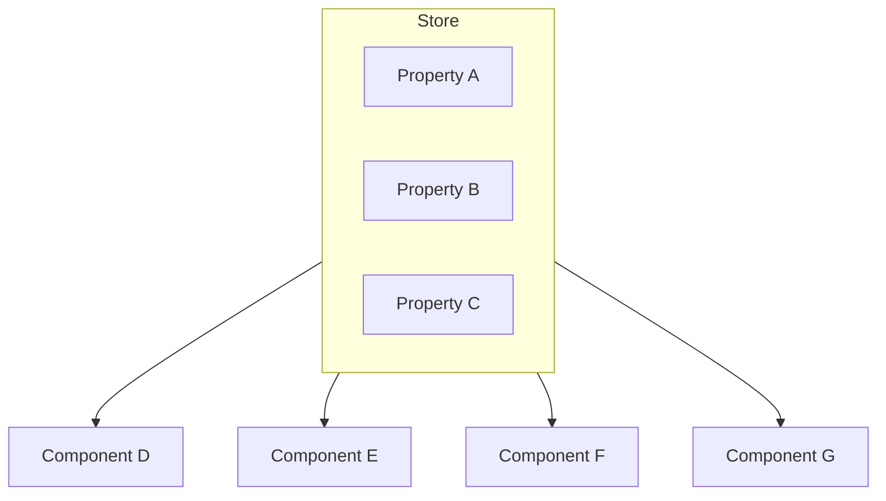
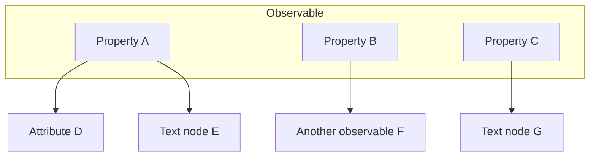

<div align="center">
  
  <p>A Vainilla Library for Web Components</p>

  [![Open in Visual Studio Code][open-in-vscode]][open-in-vscode-url] 
  ![npm][version] 
  [![license][github-license]][github-license-url] 
  ![npm][npm-downloads] 
  ![npm][repo-size]
  ![npm][minzipped-size]
  [](https://github.com/michijs/michijs/actions/workflows/codeql-analysis.yml)
  [](https://github.com/michijs/michijs/actions/workflows/tests.yml)

</div>

## Why "MichiJS?"

|  | MichiJS  |  React  |  StencilJS  | SvelteJS | VanillaJS |
|--|--|--|--|--|--|
| Prefer real DOM over virtual DOM | ✅ | ❌ | ❌ | ✅ | ✅ |
| Dynamic Constructable Stylesheets support | ✅ | ❌ | ❌ | ❌ | ❌ |
| Styling / Constructable Stylesheets support | ✅ | ❌ | ✅ | ❌ | ✅ |
| Prefer Javascript templates over compiled plain text | ✅ | ✅ | ✅ | ❌ | ✅ |
| Templates with [JSX](https://es.reactjs.org/docs/introducing-jsx.html) | ✅ | ✅ | ✅ | ❌ | ❌ |
| [Element internals](https://developer.mozilla.org/en-US/docs/Web/API/ElementInternals) support | ✅ | ❌ | ❌ | ❌ | ✅ |
| Does not require extensions to be identified by the IDE | ✅ | ✅ | ✅ | ❌ | ✅ |
| [Differentiation between attributes and properties in jsx / templates](#attributes-vs-properties-in-jsx) | ✅ | ❌ | ❌ | ❌ | ❌ |
| Standard Web Components | ✅ |  ⭕ <sup>1</sup> | ✅ | ✅ | ✅ |
| Observables / stores support | ✅ | ⭕ <sup>2</sup> | ⭕ <sup>2</sup> | ⭕ <sup>2</sup> | ❌ |
| [Esbuild](https://esbuild.github.io/)  as default bundler | ✅ | ❌ | ❌ | ❌ |❌ |
| [TypeScript](https://www.typescriptlang.org) support | ✅ | ✅ | ✅ | ✅ | ⭕<sup>2</sup> |
| Reactive | ✅ | ✅ | ✅ | ✅ | ❌ |
| Automatic component type generation | ✅ | ❌ | ✅ | ❌ | ❌ |
| Attributes / Native events support | ✅ | ❌ <sup>3</sup> | ⭕<sup>4</sup> | ✅ | ✅ |
| Supports [Shadow DOM](https://developers.google.com/web/fundamentals/web-components/shadowdom) | ✅ | ❌ | ✅ | ✅ | ✅ |
| Supports Custom Built-in elements | ✅ | ❌ | ❌ | ✅ | ✅ |
| Can be used with different frameworks right out of the box | ✅ | ❌ | ✅ | ⭕<sup>5</sup> | ✅ |
| ✅ = implemented
| ⭕ = partially implemented
| ❌ = not implemented

<details>
  <summary>More details</summary>
  <ol>
    <li>React does not support web elements until version 19</li>
    <li>Only with separated / external packages - Not an unique-state-first approach</li>
    <li>React only supports properties and synthetic events</li>
    <li>StencilJS only supports properties</li>
    <li>Svelte components can be shared only using custom elements</li>
  </ol>
</details>

## Getting Started

You can use [this template](https://github.com/michijs/michijs-template) or you can see on [Code Sandbox](https://githubbox.com/michijs/michijs-storybook-template/tree/master).
  
## Creating components

### Your first custom element
MichiJS custom elements are plain objects.

New components can be created using the `jsx/tsx` extension, such as `MyCounter.tsx`.

```tsx
import { createCustomElement, EventDispatcher } from "@michijs/michijs";
import { counterStyle } from "./counterStyle";

export const SimpleCounter = createCustomElement("simple-counter", {
  reflectedAttributes: {
    count: 0,
  },
  methods: {
    decrementCount() {
      this.count(this.count() - 1);
    },
    incrementCount() {
      this.count(this.count() + 1);
    },
  },
  events: {
    countChanged: new EventDispatcher<number>(),
  },
  adoptedStyleSheets: { counterStyle },
  render() {
    this.count.subscribe(this.countChanged);
    return (
      <>
        <button onpointerup={this.decrementCount}>-</button>
        <span>{this.count}</span>
        <button onpointerup={this.incrementCount}>+</button>
      </>
    );
  },
});
```

Note: the `.tsx` extension is required, as this is the standard for TypeScript classes that use JSX.

To use this component, just use it like any other HTML element:

```tsx
import '../Counter';

<my-counter oncountchanged={(ev) => console.log(`New count value: ${ev.detail}`)} />
```

Or if you are using jsx
```tsx
import Counter from '../Counter';

<Counter oncountchanged={(ev) => console.log(`New count value: ${ev.detail}`)} />
```

### Component structure
A component consists of the following properties:

<table>
  <thead>
    <tr>
      <th>Property</th>
      <th colspan="3">Description</th>
    </tr>
  </thead>
  <tbody>
    <tr>
      <td>attributes</td>
      <td colspan="3">Allows to define attributes.</td>
    </tr>
    <tr>
      <td>reflectedAttributes</td>
      <td colspan="3">Allows to define <a href="https://developers.google.com/web/fundamentals/web-components/customelements#reflectattr">reflected attributes</a> and follows the Kebab case. A reflected attribute cannot be initialized with a true value
      </td>
    </tr>
    <tr>
      <td>methods</td>
      <td colspan="3">Methods are functions that notify changes at the time of making the change.</td>
    </tr>
    <tr>
      <td>adoptedStyleSheets</td>
      <td colspan="3">Allows to use <a href="https://developers.google.com/web/updates/2019/02/constructable-stylesheets">Constructable Stylesheets.</a> Remember that you need to use Shadow DOM to be able to use Constructable Stylesheets. In case your component doesn't support this feature, it will return a style tag.</td>
    </tr>
    <tr>
      <td>cssVariables</td>
      <td colspan="3">Allows to define CSS variables.</td>
    </tr>
    <tr>
      <td>reflectedCssVariables</td>
      <td colspan="3">Allows to define reflected CSS variables and follows the Kebab case. A reflected CSS variable cannot be initialized with a true value</td>
    </tr>
    <tr>
      <td>computedStyleSheet</td>
      <td colspan="3">Allows you to define a Constructable Stylesheet that depend on the state of the component. When there is no shadow root the style will be reflected in the style attribute.</td>
    </tr>
    <tr>
      <td>render</td>
      <td colspan="3">Function that renders the component.</td>
    </tr>
    <tr>
      <td rowspan="15">lifecycle</td>
      <tr>
        <td rowspan="9">Custom Element related</td>
        <tr>
          <td>willConstruct</td>
          <td>This method is called at the start of constructor.</td>
        </tr>
        <tr>
          <td>didConstruct</td>
          <td>This method is called at the end of constructor.</td>
        </tr>
        <tr>
          <td>connected</td>
          <td>This method is called when a component is connected to the DOM.</td>
        </tr>
        <tr>
          <td>willMount</td>
          <td>This method is called right before a component mounts.</td>
        </tr>
        <tr>
          <td>didMount</td>
          <td>This method is called after the component has mounted.</td>
        </tr>
        <tr>
          <td>willReceiveAttribute</td>
          <td>This method is called before a component does anything with an attribute.</td>
        </tr>
        <tr>
          <td>disconnected</td>
          <td>This method is called when a component is disconnected from the DOM.</td>
        </tr>
        <tr>
          <td>didUnmount</td>
          <td>This method is called after a component is removed from the DOM.</td>
        </tr>
      </tr>
      <tr>
        <td rowspan="5">Form-associated Custom Element related</td>
        <tr>
          <td>formAssociatedCallback</td>
          <td>Called when the browser associates the element with a form element, or disassociates the element from a form element.</td>
        </tr>
        <tr>
          <td>formDisabledCallback</td>
          <td>Called after the disabled state of the element changes, either because the disabled attribute of this element was added or removed; 
      or because the disabled state changed on a fieldset that's an ancestor of this element. The disabled parameter represents the new disabled state of the element. The element may, for example, disable elements in its shadow DOM when it is disabled.</td>
        </tr>
        <tr>
          <td>formResetCallback</td>
          <td>Called after the form is reset. The element should reset itself to some kind of default state. For input elements, this usually involves setting the value property to match the value attribute set in markup (or in the case of a checkbox, setting the checked property to match the checked attribute.</td>
        </tr>
        <tr>
          <td>formStateRestoreCallback</td>
          <td>
          Called in one of two circumstances:
            <ul>
              <li>
              When the browser restores the state of the element (for example,after a navigation, or when the browser restarts). The mode argument is "restore" in this case.
              </li>
              <li>
              When the browser's input-assist features such as form autofilling sets a value. The mode argument is "autocomplete" in this case.
              </li>
            </ul>
            The type of the first argument depends on how the setFormValue() method was called. 
          </td>
        </tr>
      </tr>
    </tr>
    <tr>
      <td>events</td>
      <td colspan="3">Allows you to define an <a href="https://developer.mozilla.org/en-US/docs/Web/Guide/Events/Creating_and_triggering_events">event</a> to his parent and triggering it easily. It will be defined using Lower case. For example countChanged will be registered as countchanged.</td>
    </tr>
    <tr>
      <td>shadow</td>
      <td colspan="3">Allows you to add a Shadow DOM. By default, it uses open mode on Autonomous Custom elements and does not use Shadow DOM on Customized built-in elements. Only <a href="https://dom.spec.whatwg.org/#dom-element-attachshadow">this elements</a> are allowed to use Shadow DOM.</td>
    </tr>
    <tr>
      <td>formAssociated</td>
      <td colspan="3">This tells the browser to treat the element like a <a href="https://web.dev/more-capable-form-controls/">form control</a>.</td>
    </tr>
    <tr>
      <td rowspan="3">extends</td>
      <td rowspan="3">Allows to create a <a href ="https://developers.google.com/web/fundamentals/web-components/customelements#extendhtml">Customized built-in element</a></td>
      <tr>
        <td>tag</td>
        <td colspan="3">The tag to extend</td>
      </tr>
      <tr>
        <td>class</td>
        <td colspan="3">The class you want to extend</td>
      </tr>
    </tr>
  </tbody>
</table>

If the extends field is not provided an [Autonomous custom element](https://developers.google.com/web/fundamentals/web-components/customelements#shadowdom) will be created.

### Component lifecycle


Callbacks can be called at almost any point of the lifecycle

## How this works?
### The problem with stores - the traditional approach
Libraries traditional approach is usually based on stores.

This approach brings two major issues:
- Any update on the store will trigger an update on a component even if the property that changed store has no relation to the component. Every tag / attribute / etc will need to be checked for changes in every rerender.
- There is now way to set static properties in a dinamic environment. Take this React example:
```tsx
const [value, setValue] = useState(0);
<input type="number" value={value} onChange={(e) => setValue(e.target.value)}>
```
In this example value is updated every time input changes; which, by definition, is wrong. Why? Because value *"Specifies the default value"*. This means that the value does not need to be updated after the first render, since it has no effect. *"But React says that you can use defaultValue!"* Yes, but it's not the standard way to do it and it's one of the most common mistakes most React developers make. All this, for not using the platform.

With Michijs the solution is:
```tsx
const value = useObserve(0);

<input type="number" value={value()} onchange={(e) => value(e.target.value)}>
```

### Observers / Signals
 Observers are a behavioral design pattern that defines a one-to-many dependency between objects. When the observable / subject undergoes a change in state, all its dependents (observers / subscribers) are notified and updated automatically with a signal.


This approach allows for a much more granular update. Instead of updating an entire component, you can update html elements, attributes, or a simple text node and still maintain the principle of a single source of truth.


When a node is garbage collected in the next update will be unsubscribed.

### Rendering - Static vs dynamic
Taking the above into account, the rendering process changes drastically. Instead of rendering the entire component with each change, __we render the component only once and the changes are managed through the observables__.

For example:

```tsx
import { createCustomElement, useComputedObserve } from "@michijs/michijs";

createCustomElement("test-component", {
  reflectedAttributes: {
    valueA: 0,
    valueB: 1,
  },
  methods: {
    incrementValueB() {
      this.valueB(this.valueB() + 1);
    },
  },
  render() {
    const sum = useComputedObserve(() => this.valueA() + this.valueB(), [this.valueA, this.valueB])
    return (
      <>
        <button onpointerup={this.incrementValueB}>Increment B</button>
        {/* Renders 0, but is static */}
        <span>{this.valueA()}</span>
        {/* Renders 1, but is dinamic and will change when clicking on the button */}
        <span>{this.valueB}</span>
        {/* Renders 1, but is static */}
        <span>{this.valueA() + this.valueB()}</span>
        {/* Renders 1, but is dinamic and will change when clicking on the button */}
        <span>{sum}</span>
      </>
    );
  },
});
```

### Operators
Since all observables are objects, operators works in a different way.
We support most operators without explicitly calling the getter of the observable.

```tsx
  const a = useObserve(0);
  // Valid Javascript - Not valid Typescript
  const b = a + 1;
```
This is valid Javascript but is [not valid in Typescript yet](https://github.com/microsoft/TypeScript/issues/43826).

```tsx
  const a = useObserve("Hello");
  // Valid
  const b = a + " World";
```

We do not support boolean operators since proxies are objects:
```tsx
  const a = useObserve(false);
  // Valid - Returns 2
  const b = a() ? 1: 2;
  // Valid but wrong usage - Returns 1 since "a" is an object
  const b = a ? 1: 2;
```

## Hooks
There are several differences between our hooks and traditional ones:
- Can be used in various contexts, including top-level script code, functional components, and custom hooks. This flexibility allows developers to encapsulate logic and state management using hooks in different parts of their application.
- Most of them returns observables.

The ability to use hooks outside of component code can be beneficial for managing application-wide state, setting up global side effects, or encapsulating reusable logic in utility functions or modules.
It provides more flexibility in organizing code and separates concerns by allowing developers to centralize state management and side effects in hooks that can be reused across components or accessed from different parts of the application.

### Basic hooks
#### useObserve
Responsible for observing changes on different types of values. Takes two arguments:
- item: The value to be observed.
- initialObservers: An array of initial observers of type Subscription<T>.
This is the most basic hook and it is the basis of the entire component structure.

#### usePureFunction
It is used to create a memoized function that encapsulates the result of the provided callback function and updates it only when any of the dependencies change. Takes two arguments:
- callback: A function that returns a value of type T.
- deps: An array of dependencies that the callback function depends on.

#### useAsyncComputedObserve
It is used for computing a value and observing its changes. Takes four arguments:
- callback: A function that returns a promise of type T.
- initialValue: Initial value of type T.
- deps: Dependencies to watch for changes.
- options: Optional object that may contain onBeforeUpdate and onAfterUpdate callback functions.

#### useComputedObserve
It is used for computing a value and observing its changes. Takes three arguments:
- callback: A function that returns a value of type T.
- deps: Dependencies to watch for changes.
- options: Optional object that may contain onBeforeUpdate and onAfterUpdate callback functions.

#### useStringTemplate
It is used to create a string template by interpolating dynamic values.
```tsx
  const a = useObserve(3);
  // Returns an observable with initial value 'Test 3' and subscribed to a
  const b = useStringTemplate`Test ${a}`;
```

#### useWatch
A simple mechanism for watching dependencies and invoking a callback when any of them change. Takes two parameters:
- callback: A function that returns a value of type T. This is the function that will be invoked when any dependency changes.
- deps: Optional array of dependencies to watch for changes.

#### useFetch
Fetches data from a URL, parses the response as JSON and allows to manage the result as an observable. Takes three parameters:
- callback: The callback to get the options for the request
- shouldWait: All the promises that should resolve before executing the promise.
- options: Some additional options 

#### usePromise
Ues a promise and allows to manage the result as an observable.
- callback: The operation.
- shouldWait: All the promises that should resolve before executing the promise.

### Route management hooks
#### useHash
It is designed to manage the hash portion of the URL. Provides a way to manage and observe changes in the hash portion of the URL, ensuring synchronization between the hash value and the observable state.

Returns the Hash observable with the specified type T, ensuring that it returns an observable with keys of type T and boolean values.

#### useSearchParams
It facilitates the management and observation of search parameters in the URL, providing a reactive way to handle changes and update the URL accordingly.

#### useTitle
Allows to observe the document title. Do not use document.title use this hook instead

### Storage hooks
#### useStorage
Allows for observing changes in an object and synchronizing it with the browser's storage (such as localStorage). Takes two parameters:
- item: The object to be observed and synchronized with storage.
- storage: The storage object to be used (defaults to localStorage if not provided)

<!-- > [!TIP] -->
> If you want to use cookies we provide a class that acts like an storage called CookieStorage

#### useIndexedDB
It sets up event listeners for changes in the IndexedDB database. It returns a Proxy object that intercepts property accesses and performs corresponding IndexedDB operations. IndexedDB operations are performed asynchronously and return Promises. Takes three arguments:
- name Specifies the name of the IndexedDB database to be used or created.
- objectsStore Is a generic type that describes the structure of the object stores. It's defined as an object where each key represents the name of a property in the stored objects, and the value represents the configuration options for that property.
- version specifies the version number of the IndexedDB database. If the database with the specified name already exists and its version is lower than the provided version, it will perform any necessary upgrades.

### CSS hooks
To use css we provide functions to create Constructable Stylesheets.
__Our stylesheets can also subscribe to observables.__

#### useStyleSheet
Allows to create a Constructable Stylesheet with a CSSObject
```tsx
export const counterStyle = useStyleSheet({
  ':host': {
    display: 'flex',
    flexDirection: 'row'
  },
  span: {
    minWidth: '60px',
    textAlign: 'center'
  }
});
```
#### css
Allows to create a Constructable Stylesheet with a Template String.
[Recomended extension for VSCode](https://marketplace.visualstudio.com/items?itemName=paulmolluzzo.convert-css-in-js).

```tsx
export const counterStyle = css`
  :host {
      display: flex;
      flex-direction: row;
  }

  span {
      min-width: 60px;
      text-align: center;
  }
`
```

#### useAnimation
Generates CSS keyframes and animation properties based on the provided keyframes and options.
```tsx
const hiddenState = {
  opacity: 0,
} satisfies CSSProperties;
const shownState = {
  opacity: 1,
} satisfies CSSProperties;

const [hideKeyframe, hideProperties] = useAnimation([shownState, hiddenState], {
  duration: '2s',
  fill: 'forwards'
});
const [showKeyframe, showProperties] = useAnimation([hiddenState, shownState], {
  duration: '1s',
  fill: 'forwards'
});

export const dialogStyle = useStyleSheet((tag) => ({
  ...showKeyframe,
  ...hideKeyframe,
  [tag]: {
    ...hideProperties,
    display: 'flex',
    flexDirection: 'row',
    '[open]': showProperties
  },
}));
```
#### useTransition
Hook to generate CSS transition properties based on the provided configuration.
```tsx
const opacityTransition = useTransition({
  property: ["opacity"],
  duration: "1s",
});

export const dialogStyle = useStyleSheet((tag) => ({
  [tag]: {
    ...opacityTransition,
    display: 'flex',
    flexDirection: 'row',
    opacity: 0,
    '[open]': {
      opacity: 1
    }
  },
}));
```

#### CSS module scripts
We do not provide support for this functionality yet as ESBuild does not support it yet. You can read how it works [here](https://web.dev/css-module-scripts/)

## Components

### If
Conditional rendering component. This is the only way to do it dynamically.

### Title
Title component for dynamically updating the document's title.

### Redirect
Redirect component for navigating to a different URL or location.

### Host
Allows to set attributes and event listeners to the host element itself.

### Fragment
Creates a virtual node that wrapps elements

### ElementInternals
*(Only available if formAssociated is true)*

It allows to:
- Make the element accessible to the browser
- Access element internals 
- Validate and assign values to forms

### AsyncComponent
Asynchronously renders a component after the promise ends. In the meantime you can choose to show a load component or not show anything.

### Slot
Checks if the context element has a shadow root and renders either a standard <slot> or a MichiSlot custom element, passing along attributes and children.

When nodes are added, it checks if they have a slot attribute matching the slot's name or if no name is set, appending them to the MichiSlot and triggering a slotchange event. 

The main difference between the standard slot aned the MichiSlot is that the parent does not have a shadow DOM so **every** child appended to the parent is moved to the slot.

## Custom element methods
### child
Allows to get a child element from the host with the selector

### idGen
Create unique IDs with a discernible key

## Attributes vs Properties in jsx
Usually, if you want to get an html like this:
```html
<div class='test'></div>
```
In React / Stencil / etc you should write a jsx like this:
```tsx
() => <div className='test'></div>
```
And eventually code like this would be executed:
```tsx
const el = document.createElement('div');
el.className = 'test';
```
In MichiJS you have the freedom to use both attributes and properties and the result will be the same:
```tsx
// Using properties
() => <div _={{className: 'test'}}></div>
// Using attributes
() => <div class='test'></div>
```
And eventually code like this would be executed:
```tsx
const el = document.createElement('div');
// Using properties
el.className = 'test';
// Using attributes
el.setAttribute('class', 'test')
```
In this way the jsx syntax of MichiJS is more similar to html.

## Lists
There are 2 ways to create a list
### The static way - Using map
It's the way to create static lists from an array object. Since the result will be static, it will reflect the state of a variable when it is rendered. Useful for read-only lists.
```tsx
const arrayTest = [0, 1, 2];

arrayTest.map(item => <div>{item}</div>)
```
This will generate an element like:

```html
  <div>0</div>
  <div>1</div>
  <div>2</div>
```

### The dynamic way - Using List component
It is a component that avoids using dom diff algorithms to render dynamic lists. This allows it to have a performance close to vanilla js. An operation on the data implies an operation on the associated elements. 
```tsx
const arrayTest = useObserve([0, 1, 2]);

<arrayTest.List 
  as="span"
  renderItem={item => <div>{item}</div>}
/>
```
This will generate an element like:

```html
<span>
  <div>0</div>
  <div>1</div>
  <div>2</div>
</span>
```

### Comparison
<table>
  <thead>
    <tr>
      <th></th>
      <th>Map</th>
      <th>List component</th>
    </tr>
  </thead>
  <tbody>
    <tr>
      <td>Performance</td>
      <td colspan="2">Close to vanilla</td>
    </tr>
    <tr>
      <td>Container</td>
      <td colspan="2">Virtual fragment or any other element</td>
    </tr>
    <tr>
      <td>Data</td>
      <td>Static</td>
      <td>Dynamic</td>
    </tr>
    <tr>
      <td>Updates</td>
      <td>No</td>
      <td>Only when an operator is triggered on the list or its elements</td>
    </tr>
  </tbody>
</table>

## Routing
The intention of using a custom routing tool is to avoid the use of strings to represent the urls and to use modern apis that allow the use of the URL object itself. It also allows to separate the components of the routes which allows a cleaner code.

```tsx
//Parent routes
export const [urls, Router] = registerRoutes({
  syncRoute: <div>Hello World</div>,
  //Redirect route
  '/': <Redirect to={url} />
});

//Child routes
export const [urlsChild, RouterChild] = registerRoutes({
  // Async route
  asyncChildRoute: (
    <AsyncComponent
      promise={async () => (await import('./AsyncChildExample')).AsyncChildExample}
      loadingComponent={<span>loading...</span>}
    />
  ),
  //The parent route
}, urls.syncRoute);

// Will generate this url: /sync-route/async-child-route?searchParam1=param+1&searchParam2=2#hash1
const generatedUrl = urlsChild.asyncChildRoute({ 
  searchParams: { 
    searchParam1: 'param 1', 
    searchParam2: 2
  }, 
  hash: '#hash1' 
})
```
Router and RouterChild are components that represent the mount points of each registered route.

```tsx
const AsyncChildExample: FC = () => {
    const searchParams = useSearchParams<{
      searchParam1: string, 
      searchParam2: number
    }>();
    const hash = useHash<'#hash1'| '#hash2'>();
    return (
      <>
        {/* Will show the value of searchParam1 */}
        <div>{searchParams.searchParam1}</div>
        {/* Will show true if the hash is #hash1 */}
        <div>{hash['#hash1']}</div>
      </>
    );
}

export default AsyncChildExample
```

## I18n
It is supported using observables. By default, the desired languages are taken from the browser. If your code supports an exact match (e.g., "en-UK") or a general match (e.g., "en"), that language will be selected. Otherwise, it falls back to the default language (the first one in the list). The default language cannot be obtained asynchronously.
```tsx

const { lang } = useStorage({
  lang: navigator.language,
});

const translator = new I18n(["en-uk", "es"], lang);

const t = translator.createTranslation({
  "en-uk": {
    dogBit: "The dog bit its owner",
    birthDay: (date: Date) => `My birthday is ${date.toLocaleDateString('en-uk')}`,
  },
  es: () => import("./translations/es.json"),
});

export const MyComponent = createCustomElement('my-component', {
  render() {
    return (
      <>
        <p>{t.dogBit}</p>
        <p>{t.birthDay(new Date(1997, 20, 2))}</p>
      </>
    );
  }
});
```

## Limitations
### Observable objects
Because some objects are not proxy compatible we limit the observable objects to:
- Arrays
- Dates
- Maps
- Sets
- Any object whose prototype is Object

However, we still support assignments to such complex objects in that case you will have to cast those ones with ObservableComplexObject.

```tsx
  const observable = useObserve({
    file: new File([''], 'test') as unknown as ObservableComplexObject<File>
  })
```

This is because Typescript doesnt provide any tool to know if a type is part of the global namespace.

## Polyfills
If you REALLY need polyfills i recommend you to read this topics:

- https://www.webcomponents.org/polyfills
- https://ungap.github.io

### Built-in elements in Safari
We provide partial support for Safari's built-in elements by emulating their behavior with a custom element, michi-generic-element. This is necessary to manage the element's lifecycle and support adoptedStyleSheets.

## Browser Support

### Customized built-in elements
- https://www.chromestatus.com/feature/4670146924773376

### Autonomous custom elements
- https://www.chromestatus.com/feature/4696261944934400
- https://www.webcomponents.org/

### Compatibility with frameworks
- https://custom-elements-everywhere.com

### Element internals
- https://developer.mozilla.org/en-US/docs/Web/API/HTMLElement/attachInternals

## Supporting MichiJS
### Sponsors
Support us with a donation and help us continue our activities [here](https://www.paypal.com/paypalme/lsegurado2).
<!-- ### Contributors
TODO:
<a href="https://github.com/@lsegurado/ls-element/graphs/contributors">
  
</a> -->


<!-- ### Open Collective

Support us with a donation and help us continue our activities. [[Contribute](https://opencollective.com/ls-element)]

### Sponsors

Become a sponsor and get your logo on our README on GitHub with a link to your site. [[Become a sponsor](https://opencollective.com/ls-element#sponsor)] -->

## License
 - [MIT](https://github.com/michijs/michijs/blob/master/LICENSE.md)

[open-in-vscode]: https://img.shields.io/static/v1?label=Open%20in&logo=Visual%20Studio%20Code&message=Visual%20Studio%20Code&logoColor=007ACC&color=007ACC
[open-in-vscode-url]: https://vscode.dev/github/michijs/michijs-template
<!-- [open-in-vscode-url]: vscode://github.remotehub/open?url=https://github.com/lsegurado/ls-element -->
[minzipped-size]: https://img.shields.io/bundlephobia/minzip/@michijs/michijs
[repo-size]: https://img.shields.io/github/repo-size/michijs/michijs
[npm-downloads]: https://img.shields.io/npm/dt/@michijs/michijs
[version]: https://img.shields.io/npm/v/@michijs/michijs
[github-license]: https://img.shields.io/github/license/michijs/michijs
[github-license-url]: https://github.com/michijs/michijs/blob/master/LICENSE.md
